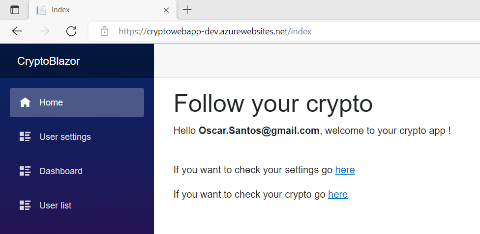
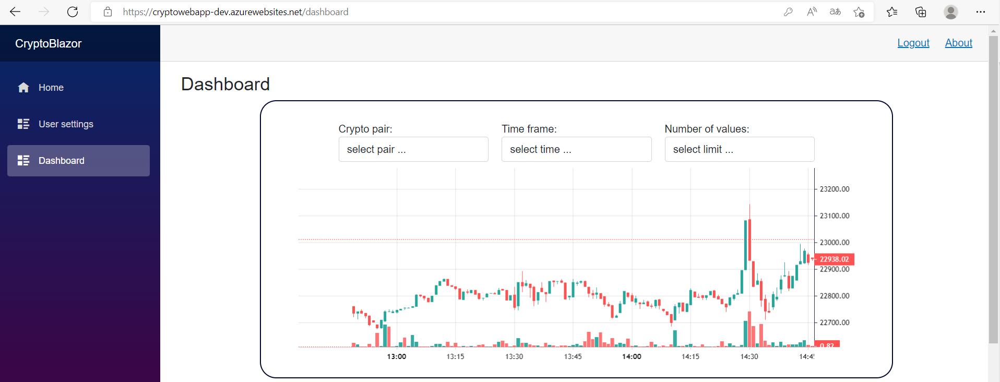

# CryptoProject

## Table of Contents

* [About the Project](#about-the-project)
* [Getting Started](#getting-started)
* [Backend](#backend)
* [Frontend](#frontend)
* [Application](#application)
* [Functional Architecture](#functional-architecture)
    * [Architecture Explanation](#architecture-explanation)
* [CI/CD](#cicd)
    * [CI](#ci)
        1. [CI Backend](#ci-backend)
        2. [Backend Prod and Frontend Prod](#backend-prod-and-frontend-prod)
    * [CD](#cd)
    * [Example: New feature to the app](#example-new-feature-to-the-app)
* [IaC](#iac)
* [Contributors](#contributors)

## About the Project

This is a web application to monitor crypto currencies prices. The project was developed using DevOps practices and deployed to Microsoft Azure with Azure DevOps Pipelines and Terraform.

This project was developed by 4 Cloud & DevOps interns of VISEO.
Since none of us had a preference for working with any particular part of the project we split up randomly.
The team consisted of:
- Alice Goumain [*Frontend* (Dashboard)]
- Rim Ben Aziza [*Frontend* (Authentication)]
- Anass Halout [*Backend* (Controllers and Integration Tests)]
- **Oscar Santos** [*Backend* (Controllers and Unit Tests)]

Additonally, I end up doing IaC too.

## Getting Started

The original development resided at Azure Repos. This GitHub repository was created to explain what we have done and it is just explained by me. So you won't find the original commits of the development, neither the branches used to do so.

The development was splitted into the follwing branch organization

- **main** (used for production)
- **dev** (used as working branch)
- **backend/dev** (principal branch for backend team)
    - **backend/feature/*** (where * represent the name of the feature)
- **frontend/dev** (principal branch for frontend team)
    - **frontend/feature/*** (where * represent the name of the feature)

Once features were completed, they were merged into respective team principal branch, then merged to dev and finally to main.

## Backend

Follow Backend [REAMDE](CryptoAPI/README.md) to get started

## Frontend

Follow Frontend [REAMDE](CryptoBlazor/README.md) to get started

## Application

The UI consists of a website with login, sign up, home, dashboard and user 
setting pages. They all connect to the backend.

First, the user open its browser and access to the website, the user can either sign up or log in with its credentials to be redirected to the home page.

User can update its settings like the theme or update his information.

The main part is the dashboard, which gets the crypto currency history from Bitfinex API and show it to the user in charts with options to filter by currency, time frame and limits.

Notice that at this point we have one single dashboard.

## Functional Architecture

There are two functional architectures that were built in distinct stages of the 
project. Both share some elements in common such as Azure Active Directory 
tenant, Azure subscription, Azure DevOps organization and project, Azure Key 
Vault, Azure SQL Database, and task repartition within the team.
The first approach of the architecture was to deploy the code using Azure 
DevOps into Azure App Services, a.k.a. Web Apps.
The infrastructure and workflow are shown below in the image

<h3>Architecture Explanation</h3> <i>click here</i>

As it can be seen, the workflow of the DevOps Engineer resembles the DevOps 
flow. First, the User stories are written in Azure Boards and taken as work items 
by the DevOps Engineer. It develops either with Visual Studio or VSCode and 
push the code into Azure Repos. Within Azure DevOps, a CI Azure Pipeline is 
created to build, test, and publish an artifact from the new changes of a specific 
branch. Then, another Azure Pipeline for CD is created to take the artifacts of the 
CI pipeline and deploy them to Azure App Services, previously created with 
Terraform. To run the pipelines and create resources with Terraform the DevOps 
team register the applications into the Azure AD tenant. Code from backend is 
published into one Azure App Service and code from frontend is published to 
another Azure App Service, ensuring loosely coupled components of application. 
Both Web Apps share the same App Service plan and can be scaled at the same 
time, however, it is possible to change infrastructure so that they can be scale 
independently. The frontend deployment connects user request to the API of the 
backend deployment and API connects with data stored in the Azure SQL 
Database. Those steps are invisible for the user and is only necessary to access 
the website endpoint provided by the frontend Web App. To avoid sensitive 
secret keys pushed into the repo inside the code, Azure Key Vault was used to 
store those, including database connection string. The pipeline automatically 
accesses the key vault before deploying the code into the services. Finally, Azure 
Application Insights is used to monitor the application and then add new work 
items into Azure Boards.

The second approach was to deploy a containerized version of the application 
into Azure Container Instances.
The infrastructure and workflow are shown below in the Figure

Similarly, the DevOps process starts with User stories in Azure Boards and 
DevOps Engineer develop code in one of the Integrated Development 
Environments (IDE), as Docker is just a file VSCode is preferred in this case. Then, 
the pipeline itself creates two images and deploys them to Azure Container 
Registry, one for backend code and one for frontend code. From the created 
images, either the Engineer or the pipeline can create a deployment in Azure 
Container Instances (ACI), once again, one for each image. The internal flow of 
the application remains the same, user access the website, in this case from an 
IP provided by the frontend ACI, the frontend connects to backend and backend to the database. This time monitoring comes from ACI and not Azure App 
Service.

The Docker files are not included in this repository project as this stage of the project is not yet finished.

<h2>CI/CD</h2> <i>click here</i>

### CI

We have developed 3 CI pipelines:
1. [CI Backend](azure-pipelines-ci-backend.yml)
2. [Backend Prod](azure-pipelines-publish-backend.yml)
3. [Frontend Prod](azure-pipelines-publish-frontend.yml)

#### CI Backend 

The first one checks integrity and find bugs in early stages on **backend/dev** branch.

Tests were integrated into the [CI Backend](azure-pipelines-ci-backend.yml) and [Backend Prod](azure-pipelines-publish-backend.yml) Pipelines, and they were useful to detect bugs along the development lifecycle. Once a developer made a pull request to merge its work into the branches, the pipeline was triggered to verify if an error was introduced even if there were not merge conflicts.
To illustrate the problem an accidental bug was introduced into a new fake 
branch called **backend/feature/accidentalbug**. The changes are intended to be 
merged into the **backend/dev** branch which contains the work from backend 
developers before being merged into the **dev** branch that contains the frontend 
project too.

As shown in the Figure above, despite there are not any merge conflicts the CI 
Backend build pipeline failed due to tests that failed. In that case the developer 
who is reviewing the pull request can simply reject the pull request and ask their team to fix the 
bug, push their code and do a pull request again. In this case, the reviewer was 
also me.

Once fixed, the tests pass and pull request can be merged without risks. The 
following screenshot shows that **17/17** of the integration tests passed and that 
**19/19** of the unit tests passed, therefore the build succeeded the dotnet test 
Release task.

So, even for personal development tests are great to catch bugs before they get 
into production.

#### Backend Prod and Frontend Prod
Second and third pipeline were used on the **main** branch to build, test, and 
publish artifacts that will be used later by the CD pipelines that publish into Azure 
App Services.

Notice that the [Backend Pipelines](azure-pipelines-publish-backend.yml) use a variable called *connectionstring*, which comes from a variable group that has access to Azure Key Vault. Then, the value of the connection string is replaced in the appsettings.json file with the FileTransform task.

### CD

The second, part was to create the CD pipelines:
1. Azure App Service – Backend
2. Azure App Service – Frontend

The first one takes the artifact published by **Backend Prod** and it has a single 
stage with one task to publish the Web App. Same for Frontend with artifact 
from **Frontend Prod**.

Once both CI and CD pipelines are set up, code simply need to be added to the 
**main** branch to trigger CI and thereby CD.

### Example: New feature to the app

If we were to add a second chart to our application, one engineer from the 
DevOps team should do a pull request to the main branch to merge his feature
In this case, to simply the example I did it directly to main, but the workflow to add a feature should always follow what I explained in the [Getting Started](#getting-started) section.

Then, pipelines are triggered

The reason **Frontend Prod** was the only CI pipeline triggered is that on the 
pipeline code there are excluded paths as it can be seen on the [Frontend Prod](azure-pipelines-publish-frontend.yml) yml. And given that the feature is made only on the Frontend Project, the **Backend Prod** is NOT triggered.

After it finishes, the **Azure App Service – Frontend** pipeline starts immediately 
with the produced artifact and deploy to the corresponding App Service resource 
in Azure.

Once finished, the second dashboard can be seen in the dashboard page of our 
UI.

Additionally, it would be possible to generate multiple environments for various stages in the CD Pipelines. And make Terraform create them for you.

Even we can add pre approval to launch the release after the artifacts are generated by the CI Pipeline.

## IaC

Follow IaC [REAMDE](IaC/README.md) to get started

## Contributors

* Oscar Santos